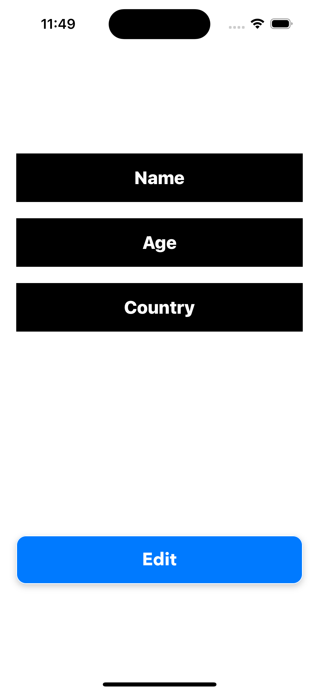
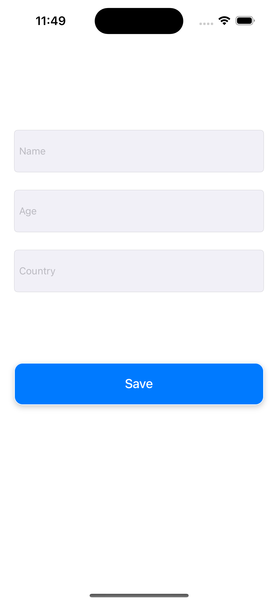
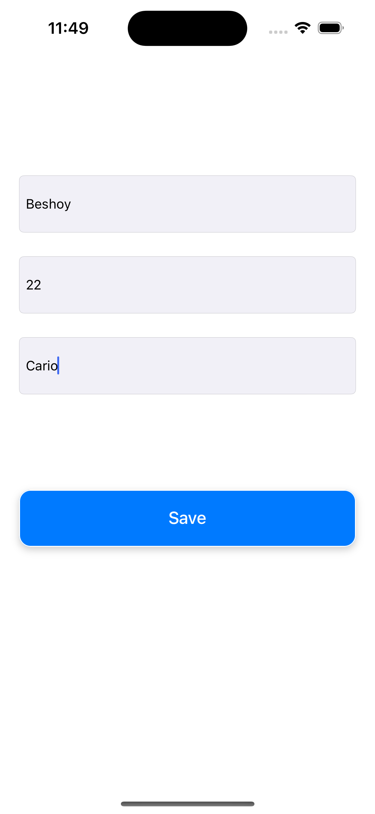

# 👤 MyProfileApp

A simple iOS application that demonstrates how to **pass data between ViewControllers using Protocol & Delegate**.

## 📱 Project Description

**MyProfileApp** is a small educational project built with UIKit. It showcases how to pass user input from an editing screen (`EditProfileViewController`) back to a main profile screen (`ProfileViewController`) using the delegate design pattern.

The app includes two main screens:
- ✅ A **Profile Screen** that displays the user's name, age, and country.
- ✏️ An **Edit Screen** where the user can update their information.

## 🛠️ Technologies Used

- Swift  
- UIKit  
- Storyboard  
- Auto Layout  
- Protocol & Delegate

## ✨ Features

- Displays personal user info (Name, Age, Country)
- Allows editing of user info
- Uses the **Delegate Pattern** to return data from one screen to another
- Simple, clean user interface

## 📸 Screenshots

>## 📸 Screenshots

  
  
  
  

)

## 🚀 Getting Started

1. Open the project in **Xcode**.
2. Make sure your Storyboard contains two ViewControllers:
   - `ProfileViewController` (set as the initial view controller)
   - `EditProfileViewController`
3. Ensure all IBOutlets and IBActions are connected properly.
4. Run the project on the simulator or a physical device.

## 👨‍💻 Developed By

**Eng\ Beshoy Atef**  
📅 July 2025

---

> This project is for educational purposes and is open-source. Feel free to use or modify it to learn and explore iOS development 🚀

